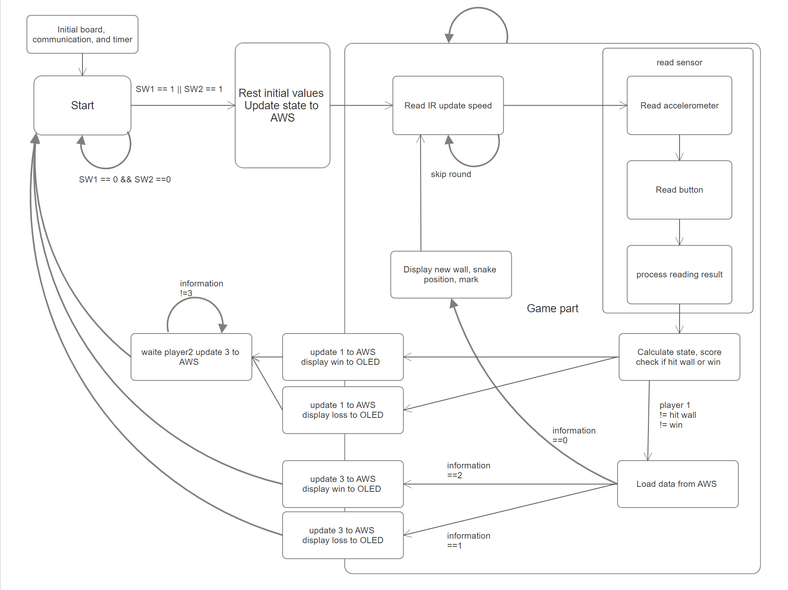
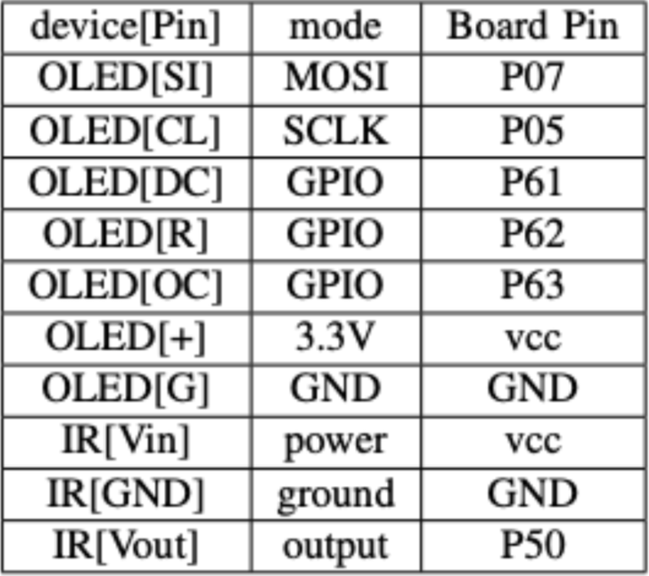

# Dual-player Snake Game on CC3200

We developed a dual-player snake game where each player takes turns to complete a snake game.
When a player scores at least five points in their turn, the other player loses. On the other hand, if that player hits the wall and dies before winning five points, the other player wins.

## Table Of Contents
* [1. Contributors](#1-contributors)
* [2. List of Materials](#2-list-of-materials)
    * [List of Hardware](#list-of-hardware)
    * [List of Software](#list-of-software)
* [3. System Structure](#3-system-structure)
    * [System Architecture](#system-architecture)
    * [Functional Specification](#functional-specification)
* [4. Implementation](#4-implementation)
    * [Pin Settings](#pin-settings)
    * [Project Structure](#project-structure)
    * [Challenges](#challenges)
* [5. References](#5-references)

## 1. Contributors
| Name | Responsibility | Email |
| ----:|---------------:|------:|
| Zhenyi Lu | Snake Game UI and structure, hardware I/O | ryalu@ucdavis.edu |
| Tao Wang | Snake Game Logic | taowang@ucdavis.edu |

## 2. List of Materials
### List of Hardware
| Name | Description | Qty | Supplier | Unit Cost ($) | Total Cost ($) |
| ----:|------------:|----:|---------:|----------:|-----------:|
| **[CC3200 LAUNCHXL](https://www.ti.com/tool/CC3200-LAUNCHXL#order-start-development)** | Microcontroller for computing | 2 | EEC172 Lab | 55 | 110 |
| **[Adafuit OLED 16-Bit OLED](https://www.adafruit.com/product/1431)** | OLED Screen that displays the Game | 2 | EEC172 Lab | 39.95 | 79.9 |
| **[ATT-RC1534801 Remote Controller](https://www.amazon.com/Replacement-Remote-Control-RC1534801-U-Verse/dp/B0B7C7Z5HR)** | Controls the snake's speed wirelessly | 2 | EEC172 Lab | 24.99 | 49.98 |
| **[Vishay TSOP31130 IR Receiver](https://www.digikey.com/en/products/detail/vishay-semiconductor-opto-division/TSOP31130/4494429?utm_adgroup=General&utm_source=google&utm_medium=cpc&utm_campaign=PMax%20Shopping_Product_Zombie%20SKUs&utm_term=&utm_content=General&utm_id=go_cmp-17815035045_adg-_ad-__dev-c_ext-_prd-4494429_sig-Cj0KCQjwpZWzBhC0ARIsACvjWROlAaTvYjQc5Kn6qTrYiuLLhUJEUtMv46Q_KxAsayviBmGatc6r_LYaAtjrEALw_wcB&gad_source=1&gclid=Cj0KCQjwpZWzBhC0ARIsACvjWROlAaTvYjQc5Kn6qTrYiuLLhUJEUtMv46Q_KxAsayviBmGatc6r_LYaAtjrEALw_wcB)** | Receives the Remote Controller's signal| 2 | EEC172 Lab| 1.41 | 2.82 |
| **[330 Ω Resistor](https://www.amazon.com/EDGELEC-Resistor-Tolerance-Multiple-Resistance/dp/B07QH5PFG3/ref=sr_1_3?crid=3L3V1S2IA8KDV&dib=eyJ2IjoiMSJ9.-yUS-QRUOwfQEjnz7IZ1kpdS-zUR6DjP0SxTPj9NSKTkdpwH4BryzKtQAhMH2DBnFqqc9R7nYkzu4Wfi8fw24ra-_lUN0pYqqvF2MRVLlyI8Hq5C2OISrs2cXvKVpjfYusxEUnKGGOWtzejXeZwWMLzdh1XL6fi8Y5X8sE5fxyIsoitGAiBm9tFLa4uDcU0gjWj0fVg6se78X645ZAZTkfToQohQ5ipi66AZaL2YXH4.EoSHIr0RBP3iyWt1hpV7CP4zRWD5w36AaHM2K8lkNrM&dib_tag=se&keywords=330+ohm+resistor&qid=1717960040&sprefix=330+ohm+resistor%2Caps%2C254&sr=8-3)** | Stablize the supply voltage to the IR Receiver | 2 | EEC172 Lab | 0.0599 | 0.12 |
| **[10µF Capacitor](https://www.amazon.com/ALLECIN-Electrolytic-Capacitor-0-2x0-43in-Capacitors/dp/B0CMQB9QCH/ref=sr_1_1_sspa?crid=1IV3O1OA04MWP&dib=eyJ2IjoiMSJ9.ZpuCTk91KT-sqK4_s3VmOtrpVtg6KzjgOWf1WotdpYWXdw0RVSAD3Dat1rlWDMuwHIcd5v33u1SPAabuTIP3wazkzsVFaJ7njqO9n6Krql-SAoPJ2y0VbgbiFKcG3DWYOzFViC4wuXaSltTDci_yRREADpbZG8o4Frv8twBF9wc-xjSjd6zwjQ2gMNG-nhxbGtN8x5z2UBB5JTG61TljFmzXY0C2iGOc7D7fGyHioHM.HRab18bSSY_55KPuSWfugg41vnrP8QYBvgbQFrX7S8g&dib_tag=se&keywords=10µF%2BCapacitor&qid=1717960129&sprefix=330%2Bohm%2Bresistor%2Caps%2C200&sr=8-1-spons&sp_csd=d2lkZ2V0TmFtZT1zcF9hdGY&th=1)** | Stablize the supply voltage to the IR Receiver | 2 | EEC172 Lab | 0.399 | 0.798 | 
| Total | | | | | 243.6 |

### List of Software
| Name | Version | Description | Cost |
| ----:|------------:|---------:| ----:|
| **[Code Composer Studio (CCS)](https://www.ti.com/tool/CCSTUDIO)** | 12.6.0.00008 | The IDE to progeam CC3200 Microcontroller | Free |
| **[CC3200 Software Development kit](https://www.ti.com/tool/cc3200sdk)** | 1.5.0 | Contains the library functions and example programs on using them | Free |
| **[TI SYSCONFIG Tool](https://www.ti.com/tool/SYSCONFIG)** | 1.19.0 | Configures the pins on CC3200 | Free |
| **[CCS Uniflash](https://www.ti.com/tool/download/UNIFLASH/3.4.1)** | 3.4.1 | Flash the C program onto the non-volatile storage on CC3200 | Free |
| **[PuTTY Terminal](https://www.chiark.greenend.org.uk/~sgtatham/putty/latest.html)** | 0.81 | Terminal emulator that allows user to have a terminal interface in CCS | Free | 
| **[AWS IoT Core](https://aws.amazon.com/free/iot/?trk=d96365ed-3ce7-4dd5-9cab-102978dac4ce&sc_channel=ps&ef_id=Cj0KCQjwpZWzBhC0ARIsACvjWRNcSTcWp89k8iiKgbQtjjw9QsrAICBw75YWqyswXtoHmpaLF0uZogIaAiwEEALw_wcB:G:s&s_kwcid=AL!4422!3!675292217919!p!!g!!iot%20solution!19852661753!145019262697&gclid=Cj0KCQjwpZWzBhC0ARIsACvjWRNcSTcWp89k8iiKgbQtjjw9QsrAICBw75YWqyswXtoHmpaLF0uZogIaAiwEEALw_wcB)** | June 2024 | Cloud provider that connects IoT devices together | Free |

## 3. System Structure

We want each CC3200 to run the snake game and display the game on the Adafruit OLED. The board also processes inputs from the on-board accelerometer, on-board switches, and IR Receiver.

### System Architecture

Each CC3200 takes input from the sensors with the protocols labeled on the arrow. The only exception is the IR receiver, which triggers an interrupt in CC3200 to process the IR pulses.

### Functional Specification

The code starts with the Initial board, communication protocol, and timer, this block of code only executes once. after
initialization, the code gets into the start state and waits for the
player to press any key to start the initial variable of the game.
Once sw1 or sw2 is equal to 1, all the variables are reset, and
the status is rewritten to 0, and then the game starts. In the
game, it reads the input of the remote control and then reads
the accelerometer and button input once every 100 times after
completing the remote control input reading. This is to avoid
the accelerometer communication time accounting for too long
and causing the remote control start bit to be missed. When
the buttons and accelerometer input have been read, the code
processes the input and control calculation state to determine
the end of the game for win or loss or waiting for the next
reading. If the game ends and the print result is, it will be
waiting for the other player to synchronize the status from
AWS before starting the next round.

## 4. Implementation

### Pin Settings

### Project Structure
The snake game is stored in https://github.com/ttwag/EEC172-Embedded_Systems/tree/main/lab/Final/final_ccs
* final_ccs
    * **final-snake_game**: contains the entire snake game program.
        * *main.c*: Contains the entire snake game's logic and runs on the CC3200.
        * *pin_mux_config.c/pin_mux_config.h*: Configures the pins on CC3200 to the pin settings table.
        * *oled*: The oled directory stores the functions that makes SPI communication between CC3200 and Adafruit oled possible.
        * *lib_if*: Contains other necessary library functions.
        * *utils*: Contains the library functions that make WiFi connection possible.
    * final-snake_logic: a separate program that stores the logic behind the moving snake in the snake game. The game **does not depend on this directory**. It's a separate building block of the snake game during the development. 

### Challenges

There are mainly three challenges: the time conflict when reading the input signal, unstable
connection to AWS, and the link list management
of the snake. The signal read for IR needs to take more time
to make sure the starting bit won’t be missing if updating
the snake and mark every time IR read, because the drawing
function for OLED takes lots of time, remote controller signal
will be ignored. The information of the snake is managed by a
linked list, but the data structure of this part is complex and uses
large amounts of pointers, which creates some challenges in
the embedded system environment.

## 5. References

* This is the final Project for EEC172 Embedded Systems in Spring 2024. More information about this course can be found at: https://ece.ucdavis.edu/course-catalog
* The source code of the game is at: https://github.com/ttwag/EEC172-Embedded_Systems/tree/main/lab/Final/final_ccs/final-snake_game

